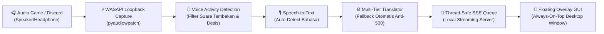

<div align="center">

# 🎮 Game Voice Translator Overlay
### *Real-Time In-Game Voice Comms Translator for Windows*

[](https://microsoft.com)
[](https://python.org)
[](https://github.com)
[](https://github.com)
[](LICENSE)

<p align="center">
  <b>Aplikasi subtitle dan penerjemah suara komunikasi tim game (Discord, Valorant, Apex Legends, Dota 2, CS2) secara real-time.</b><br>
  Menyadap audio langsung dari speaker/headphone komputer, mendeteksi suara manusia, dan menampilkan terjemahan instan ke <b>Bahasa Indonesia</b> dalam jendela melayang <b>Always-On-Top</b> tanpa membuat game lag!
</p>

[Fitur Utama](#-fitur-unggulan) • [Cara Pakai Instan](#-cara-menjalankan-langsung-1-klik) • [3 Tema Tampilan](#-tiga-tema-visual-interaktif) • [Tombol Pintas](#-kontrol--tombol-pintas-hotkeys) • [Panduan Developer](#-panduan-developer--kompilasi)

---

</div>

## 🌟 Mengapa Aplikasi Ini Berbeda?

Banyak gamer terkendala bahasa saat bermain di server luar negeri (komunikasi tim berbahasa Inggris, Jepang, Korea, Mandarin, atau Rusia). Aplikasi ini dirancang khusus untuk mengatasi 3 tantangan teknis gaming:

1. **🎧 System Audio Loopback (Bukan Mic Sendiri):**  
   Menyadap suara tim/teman yang keluar dari headphone/speaker secara jernih via **Windows WASAPI Loopback** tanpa membutuhkan *Virtual Audio Cable* tambahan.
2. **⚡ Zero-Lag & Anti-Stutter (Hemat VRAM):**  
   Dilengkapi **Voice Activity Detection (VAD)** pintar yang hanya mengirim potongan vokal manusia dan menyaring suara dentuman senjata/ledakan game. GPU tetap dingin dan FPS game tetap stabil.
3. **🪟 Murni Always-On-Top & Win32 Native Drag:**  
   Menggunakan API native Windows `WM_NCLBUTTONDOWN` sehingga jendela melayang dapat diseret melintasi seluruh monitor dengan *refresh rate* tinggi (144Hz/240Hz) **tanpa lag, tanpa kotak blur, dan bebas dari freezing / Not Responding**.

---

## 🔄 Arsitektur Pipeline



---

## 🎨 Tiga Tema Visual Interaktif

Aplikasi dilengkapi tombol **1-Klik Ganti Tema** di panel pengaturan:

| 🧸 1. Cute / Cartoonish | 🔥 2. Sangar / Gaming HUD | 💎 3. Modern / Minimalist |
| :--- | :--- | :--- |
| Sudut membal empuk (*border-radius 24px*), palet pastel & kuning ceria. | Sudut tajam miring (*chamfered edges*), hitam arang & aksen neon lava merah. | Kaca buram (*frosted glass blur 24px*), aksen slate & cyan lembut. |
| Animasi membal lembut (*spring bounce*) saat kalimat baru masuk. | Efek *glow* neon dan garis aksen HUD taktis militer. | Transisi *fade-in* bersih, proporsional, dan minimalis. |
| Font: **Nunito** & **Quicksand** | Font: **Rajdhani** & **Teko** | Font: **Inter** |

---

## 🕹️ Kontrol & Tombol Pintas (Hotkeys)

| Tombol / Aksi | Fungsi |
| :--- | :--- |
| **Klik Tahan Bilah Atas** | Menyeret (*drag*) jendela melayang ke mana pun di layar monitor dengan mulus. |
| **Tarik Sudut Kanan Bawah** | Mengubah ukuran (*resize*) jendela secara proporsional. |
| **🔒 Ikon Gembok (`Alt + L`)** | Mengunci posisi widget agar tidak sengaja tergeser saat sesi bermain sedang intens. |
| **🎯 Tembus Klik (`Alt + C`)** | Mengaktifkan mode *click-through* agar tembakan / klik mouse tembus ke game di baliknya. |
| **🗑️ Ikon Sampah (`Alt + X`)** | Membersihkan chat/subtitle lama dari layar dalam 1 klik. |
| **👁️ Sembunyikan (`Alt + T`)** | Menyembunyikan / memunculkan kembali overlay dengan cepat. |
| **⚙️ Ikon Roda Gigi** | Membuka laci pengaturan (ganti tema, slider transparansi, slider sensitivitas VAD, bahasa). |

---

## 🚀 Cara Menjalankan Langsung (1-Klik)

Tidak perlu menginstal Python atau membuka terminal jika kamu hanya ingin langsung memakainya:

1. Buka folder **`dist/VoiceTranslatorOverlay/`**.
2. Klik ganda pada berkas **`VoiceTranslatorOverlay.exe`**  
   *(Atau klik ganda berkas pintasan **`Jalankan_Voice_Translator.bat`** di folder utama)*.
3. Jendela subtitle transparan akan langsung muncul melayang di layar.
4. Putar video bahasa asing di YouTube, game, atau Discord — terjemahan otomatis akan langsung mengalir ke layar!

---

## 💻 Panduan Developer & Kompilasi

Bagi pengembang yang ingin memodifikasi atau berkontribusi pada kode sumber:

### 1. Kloning Repositori
```bash
git clone https://github.com/username/game-voice-translator-overlay.git
cd game-voice-translator-overlay
```

### 2. Siapkan Virtual Environment
```bash
python -m venv .venv
# Aktifkan virtual environment di Windows PowerShell:
.\.venv\Scripts\Activate.ps1
```

### 3. Instal Dependensi
```bash
pip install -r requirements.txt
```

### 4. Jalankan Aplikasi dalam Mode Pengembangan
```bash
# Menjalankan versi Desktop Native WebView2:
python main.py

# Atau hanya menjalankan server backend (bisa dibuka via browser http://localhost:8765):
python server.py
```

### 5. Kompilasi Ulang Menjadi Standalone Windows .EXE
Proyek ini sudah dilengkapi skrip kompilasi otomatis berbasis PyInstaller:
```bash
python build_exe.py
```
Hasil file `.exe` siap distribusi akan berada di:  
`dist/VoiceTranslatorOverlay/VoiceTranslatorOverlay.exe`.

---

## 📁 Struktur Direktori Proyek

```plaintext
game-voice-translator-overlay/
│
├── dist/                          # Hasil kompilasi siap pakai
│   └── VoiceTranslatorOverlay/
│       └── VoiceTranslatorOverlay.exe  # Aplikasi Executable Windows
│
├── main.py                        # Entry point desktop (WebView2 + Win32 Drag API)
├── server.py                      # Multi-threaded HTTP Server + Thread-safe SSE Queue
├── audio_capture.py               # WASAPI Loopback Capture (pyaudiowpatch)
├── speech_translator.py           # Engine STT & Penerjemah Multi-Tier (Anti-500 Fallback)
├── vad_filter.py                  # Modul Voice Activity Detection (RMS Energy Analyzer)
│
├── index.html                     # UI Utama Floating Subtitle Widget
├── styles.css                     # Stylesheet lengkap 3 Tema & Glassmorphism
├── app.js                         # Logika GUI, Hotkeys, Drag/Resize, dan SSE Client
│
├── build_exe.py                   # Skrip otomatisasi build PyInstaller ke .exe
├── requirements.txt               # Daftar dependensi Python
├── Jalankan_Voice_Translator.bat  # Launcher instan Windows
├── .gitignore                     # Filter file repository Git
└── README.md                      # Dokumentasi interaktif proyek
```

---

## 🛡️ Teknologi & Pustaka yang Digunakan

- **[PyAudioWPatch](https://github.com/s0d/pyAudioWPatch):** Pustaka perekam audio Windows WASAPI Loopback berkinerja tinggi.
- **[pywebview](https://pywebview.flowrl.com/):** GUI desktop WebView2 modern berukuran ultra-ringan (~40MB RAM) pengganti Electron.
- **[SpeechRecognition](https://github.com/Uberi/speech_recognition):** Engine pengenal ucapan manusia.
- **[deep-translator](https://github.com/nidhaloff/deep-translator):** Mesin penerjemah multi-provider dengan sistem fallback cerdas.
- **Windows Win32 User32 API:** Pergerakan dan pengubahan ukuran jendela berbasis modal message pump untuk latensi 0ms.

---

## 🤝 Kontribusi & Lisensi

Kontribusi, *pull request*, dan saran fitur baru sangat dipersilakan!  
Silakan buat *Issue* jika menemukan kendala teknis saat bermain di game tertentu.

Didistribusikan di bawah **Lisensi MIT**. Bebas digunakan, dimodifikasi, dan dibagikan untuk seluruh gamer dan komunitas pengembang.

<div align="center">
  <b>Dibuat dengan ❤️ untuk seluruh gamer yang berjuang di server internasional.</b><br>
  <i>Push rank tanpa kendala bahasa!</i>
</div>
